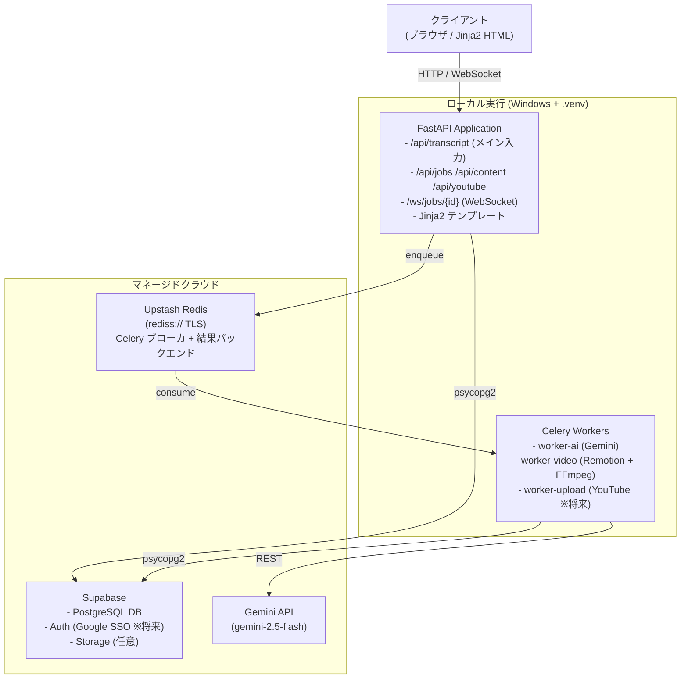

# 基本設計書
## ConversationMovie

**文書バージョン**: 2.0.0
**作成日**: 2026-05-19
**最終更新**: 2026-05-21（Supabase / Upstash / ローカル実行構成へ刷新）

**更新メモ（2026-05-23）**: 入力インターフェースは音声アップロードに加え、トランスクリプトファイルアップロード（`.txt` / `.md` / `.srt` / `.vtt`）を正式サポートする。

---

## 1. アーキテクチャ概要

### 1.1 システムアーキテクチャパターン
**非同期モノリス + マネージドクラウド**

- FastAPI を API ゲートウェイ兼テンプレートサーバとして使用
- Celery ワーカーによる非同期処理（AI 分析・動画生成）
- データ / キュー / AI はすべて **クラウドマネージドサービス** に集約
- バックエンドは **Docker を使わずローカル Python venv** で起動（MVP）



> 📌 旧設計の Docker Compose 一括起動は **MVP では未使用**。詳細は `04_システム構成図.md` 付録 A を参照。

---

## 2. モジュール設計

### 2.1 バックエンドモジュール構成

#### app/api/ - APIレイヤー（実装済み）
```
api/
  auth.py        # 認証エンドポイント（Supabase JWT 検証 ※将来）
  transcript.py  # 【メイン入力】 トランスクリプト貼り付け受付
  audio.py       # 入力アップロード（音声/トランスクリプトファイル）
  jobs.py        # ジョブ状態管理
  content.py     # 生成コンテンツ取得（要約・字幕・動画）
  youtube.py     # YouTube 投稿（雛形のみ・将来実装）
  websocket.py   # /ws/jobs/{id} リアルタイム進捗配信
```

#### app/services/ - ビジネスロジックレイヤー（実装済み）
```
services/
  gemini_service.py     # Gemini API 呼び出し（要約・分析・アバターセリフ）
  job_service.py        # ジョブステータス更新 / job_logs 記録
  storage_service.py    # ローカル MEDIA_DIR + Supabase Storage（任意）
  subtitle_service.py   # SRT / VTT 生成
  video_service.py      # Remotion レンダリング + FFmpeg 字幕合成
```

> ※ `transcription_service` / `diarization_service` / `youtube_service` は将来実装。

#### app/workers/ - Celery ワーカー（実装済み）
```
workers/
  pipeline.py               # ConversationPipeline (chain 定義)
  analysis_worker.py        # 【現行】Gemini 分析タスク
  video_worker.py           # 【現行】動画生成タスク
  transcription_worker.py   # 雛形のみ（Whisper - 将来）
  diarization_worker.py     # 雛形のみ（pyannote - 将来）
  youtube_worker.py         # 雛形のみ（YouTube - 将来）
```

#### app/models/ - データモデル（SQLAlchemy 2.0）
```
models/
  base.py                # DeclarativeBase
  user.py                # users
  job.py                 # jobs (status / progress / celery_task_id)
  job_log.py             # job_logs (タスクステップごとの実行ログ)
  audio_file.py          # audio_files（将来）
  transcription.py       # transcriptions（source: "paste" / "whisper"）
  speaker_segment.py     # speaker_segments（将来）
  analysis.py            # analyses（要約・テーマ・名言・感情・YT メタ）
  subtitle.py            # subtitles（SRT / VTT）
  avatar_character.py    # avatar_characters（マスタ）
  avatar_script.py       # avatar_scripts（生成セリフ）
  video.py               # videos
  youtube_publication.py # youtube_publications（将来）
```

---

## 3. 処理パイプライン詳細設計

### 3.1 コンテンツ処理パイプライン

`ConversationPipeline` は入力ソースに応じて 2 種類の chain を提供する。MVP は `start_from_transcript` のみ稼働。

```python
# app/workers/pipeline.py の実装
from celery import chain

class ConversationPipeline:
    """
    Celery chain を使って各ステップを直列実行する。
    各ステップは .si() (immutable signature) で起動するため、
    前ステップの戻り値ではなく job_id だけを引数に取る。
    """

    @staticmethod
    def start_from_transcript(job_id: str) -> str:
        """【現行 MVP】テキスト貼り付け → 分析 → 動画生成"""
        from app.workers.analysis_worker import run_analysis_task
        from app.workers.video_worker import run_video_generation_task

        result = chain(
            run_analysis_task.si(job_id),         # queue=ai
            run_video_generation_task.si(job_id), # queue=video
        ).apply_async()
        return result.id

    @staticmethod
    def start_from_audio(job_id: str) -> str:
        """音声ファイル → Whisper → 分析 → 動画生成"""
        from app.workers.analysis_worker import run_analysis_task
        from app.workers.transcription_worker import run_transcription_task
        from app.workers.video_worker import run_video_generation_task

        result = chain(
            run_transcription_task.si(job_id),
            run_analysis_task.si(job_id),
            run_video_generation_task.si(job_id),
        ).apply_async()
        return result.id
```

### 3.2 各ステップのI/O定義

| ステップ | 状態 | 入力 | 出力 | キュー | 失敗時の挙動 |
|---|---|---|---|---|---|
| トランスクリプト受付 | ✅ 実装済 | 貼り付けテキスト / トランスクリプトファイル | `transcriptions` レコード (source="paste/upload") | - | 422 エラー返却 |
| 文字起こし | 🔜 将来 | 音声ファイル | `transcriptions` レコード (source="whisper") | ai | リトライ3回 |
| 話者分離 | 🔜 将来 | 音声ファイル | `speaker_segments` | ai | スキップして次へ |
| AI 分析 | ✅ 実装済 | `transcriptions.full_text` | `analyses` / `subtitles` / `avatar_scripts` | ai | リトライ3回 |
| 動画生成 | ✅ 実装済 | `analyses` + `subtitles` + `avatar_scripts` | `videos` レコード + ローカル MP4 | video | リトライ2回 |
| Shorts 生成 | 🔜 将来 | MP4 + ハイライト | 縦型 MP4 | video | スキップして次へ |
| YouTube 投稿 | 🔜 将来 | MP4 + メタデータ | YouTube URL | upload | 手動投稿用 DL リンク提供 |

### 3.3 ジョブステータスと進捗

```
PENDING(0) → ANALYZING(10-45) → GENERATING_SUBTITLES(55)
          → GENERATING_VIDEO(65-92) → COMPLETED(100)
          → FAILED (任意の段階で)
```

---

## 4. フロントエンド設計

### 4.1 画面構成（MVP 実装済み）

```
/                  → /paste にリダイレクト（paste.html）
/paste             # 【メイン入力】 トランスクリプト貼り付けフォーム
/jobs/{id}         # ジョブ詳細・進捗確認（job_detail.html）
/jobs/{id}/preview # 動画プレビュー＋要約表示（job_preview.html）
/health            # ヘルスチェック JSON
/docs              # FastAPI Swagger UI（APP_DEBUG=true 時のみ）
```

**将来追加予定**

```
/auth/login        # Supabase Google SSO
/dashboard         # ジョブ一覧
/upload            # 入力ファイルアップロード（音声/トランスクリプト）
/jobs/{id}/publish # YouTube 投稿設定
/history           # 過去の動画一覧
/settings          # YouTube 連携設定
```

### 4.2 フロントエンド技術選定

**MVP段階では最軽量構成**:
- HTML + Vanilla JS + Tailwind CSS（Jinja2テンプレート）
- FastAPIのJinja2テンプレートエンジンを使用
- フロントエンドビルドなし（個人開発の複雑さを排除）
- WebSocket for リアルタイム進捗

**スケール時の移行先**: Next.js + shadcn/ui

### 4.3 主要画面レイアウト

#### アップロード画面
```
┌────────────────────────────────────┐
│  🎬 ConversationMovie              │
├────────────────────────────────────┤
│                                    │
│   ┌──────────────────────────────┐ │
│   │  ドラッグ&ドロップ             │ │
│   │  または ファイルを選択          │ │
│   │  (mp3, wav, mp4, m4a)        │ │
│   └──────────────────────────────┘ │
│                                    │
│  会議タイトル: [___________________]│
│  話者数: [自動検出 ▼]              │
│                                    │
│         [処理開始]                  │
└────────────────────────────────────┘
```

#### 処理進捗画面
```
┌────────────────────────────────────┐
│  ジョブ: 2026-05-19 定例MTG        │
├────────────────────────────────────┤
│  ✅ 音声アップロード      完了      │
│  ✅ 文字起こし           完了      │
│  🔄 話者分離             処理中... │
│  ⏳ AI分析               待機中    │
│  ⏳ 字幕生成             待機中    │
│  ⏳ 動画生成             待機中    │
│  ⏳ YouTube投稿          待機中    │
│                                    │
│  進捗: ████████░░ 60%             │
└────────────────────────────────────┘
```

---

## 5. Geminiプロンプト設計

### 5.1 要約プロンプト
```
あなたは会議の議事録作成の専門家です。
以下の会議の文字起こしを分析し、JSON形式で出力してください。

## 文字起こし
{transcript}

## 出力形式
{
  "summary_short": "3行以内の要約",
  "summary_medium": "段落形式の要約（200-300文字）",
  "summary_detailed": {
    "overview": "概要",
    "key_decisions": ["決定事項1", "決定事項2"],
    "action_items": [{"who": "担当者", "what": "タスク", "when": "期限"}],
    "next_steps": ["次のステップ"]
  },
  "themes": ["テーマ1", "テーマ2"],
  "keywords": ["キーワード1", ...],
  "quotes": [
    {"speaker": "話者名", "text": "名言テキスト", "timestamp": "00:05:23"}
  ],
  "sentiment_timeline": [
    {"timestamp": "00:01:00", "sentiment": "positive", "score": 0.8}
  ]
}
```

### 5.2 アバターセリフ生成プロンプト
```
あなたは「{character_name}」というキャラクターです。
設定: {character_description}

以下の会議要約を読んで、視聴者に向けて解説するセリフを生成してください。

## 要約
{summary}

## セリフ要件
- {duration}秒で読める長さ（約{word_count}文字）
- キャラクターの口調で話す
- 視聴者が理解しやすい言葉で
- 感情豊かに（感嘆符や疑問符を適度に使用）

キャラクター一覧と口調:
- 博士キャラ: 「なるほど、これは興味深い！専門的に解説すると...」
- ツッコミキャラ: 「え！それ、どういうこと？わかりやすく言うと...」
- まとめキャラ: 「つまり、ポイントはここだよ！」
```

---

## 6. 動画生成設計

### 6.1 Remotionコンポーネント構成
```
remotion/
  src/
    compositions/
      AvatarVideo.tsx        # メイン動画コンポーザ
      ShortsVideo.tsx        # Shorts用コンポーザ
    components/
      Avatar.tsx             # アバターアニメーション
      Subtitle.tsx           # 字幕表示コンポーネント
      Background.tsx         # 背景
      SpeakerCard.tsx        # 話者情報カード
      SentimentBar.tsx       # 感情バー
    assets/
      avatars/               # アバター画像（PNG）
      backgrounds/           # 背景画像
      fonts/                 # フォント
```

### 6.2 動画仕様

| 項目 | 標準動画 | Shorts |
|---|---|---|
| 解像度 | 1920x1080 | 1080x1920 |
| フレームレート | 30fps | 30fps |
| コーデック | H.264 | H.264 |
| 音声コーデック | AAC 192kbps | AAC 192kbps |
| 最大長 | 3時間 | 60秒 |

### 6.3 アバターキャラクター仕様

| キャラクター名 | 役割 | 口調 | 担当セクション |
|---|---|---|---|
| ハカセ | 解説者 | 知的・丁寧 | 要約・テーマ解説 |
| ツッコミちゃん | ツッコミ役 | 明るい・好奇心旺盛 | 名言・驚きポイント |
| まとめロボ | ナレーター | 落ち着いた・端的 | アクションアイテム |

---

## 7. セキュリティ設計

### 7.1 認証フロー

**MVP（現状）**: 開発用ダミーユーザー (`00000000-0000-0000-0000-000000000001`) を起動時に自動作成し、`get_current_user_id` 依存性が常にこの ID を返す。
認証ヘッダ不要でローカル動作確認できるようにしている。

**本番（将来）**:
```
1. ユーザーが「Googleでログイン」をクリック
2. Supabase Auth → Google OAuth 2.0
3. Supabase が JWT トークンを発行
4. フロントエンドがトークンを localStorage に保存
5. 以降の API リクエストに Authorization ヘッダーで送付
6. FastAPI が Supabase JWT を検証 (app/core/security.py)
```

### 7.2 Row Level Security (RLS)ポリシー
```sql
-- ユーザーは自分のジョブのみ参照可能
CREATE POLICY "Users can only see own jobs"
ON jobs FOR ALL
USING (auth.uid() = user_id);

-- ユーザーは自分のファイルのみアクセス可能
CREATE POLICY "Users can only access own files"
ON storage.objects FOR ALL
USING (auth.uid()::text = (storage.foldername(name))[1]);
```

---

## 8. エラーコード定義

| コード | 説明 | 対応 |
|---|---|---|
| E001 | 音声ファイル形式不正 | ユーザーに再アップロード依頼 |
| E002 | Whisper処理失敗 | 自動リトライ（最大3回） |
| E003 | pyannote処理失敗 | 話者分離をスキップして続行 |
| E004 | Gemini API レート超過 | 60秒待機後リトライ |
| E005 | Gemini API クォータ超過 | ユーザーに通知・翌日再試行 |
| E006 | 動画生成失敗 | エラーログ記録・手動再実行可能 |
| E007 | YouTube認証失敗 | YouTube再連携を依頼 |
| E008 | YouTube投稿失敗 | 手動投稿用ダウンロードリンク提供 |

---

*文書終端*
