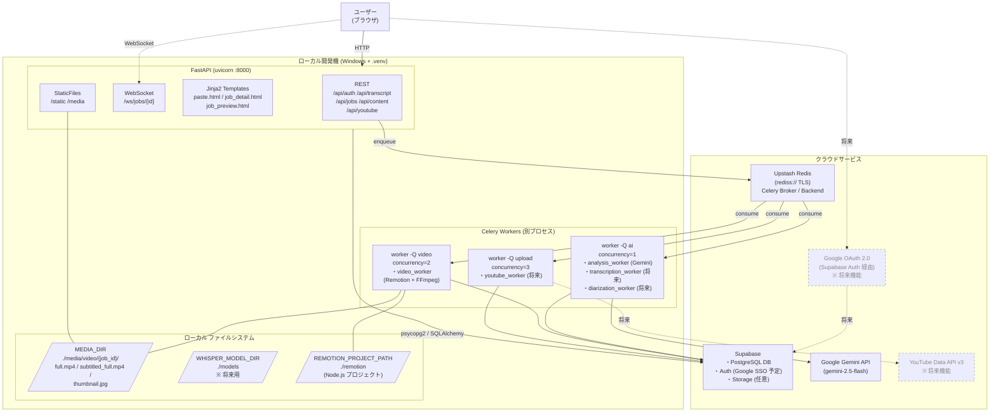
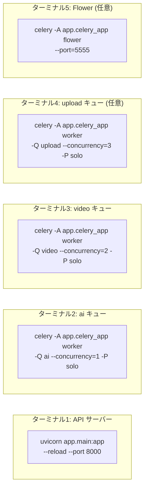
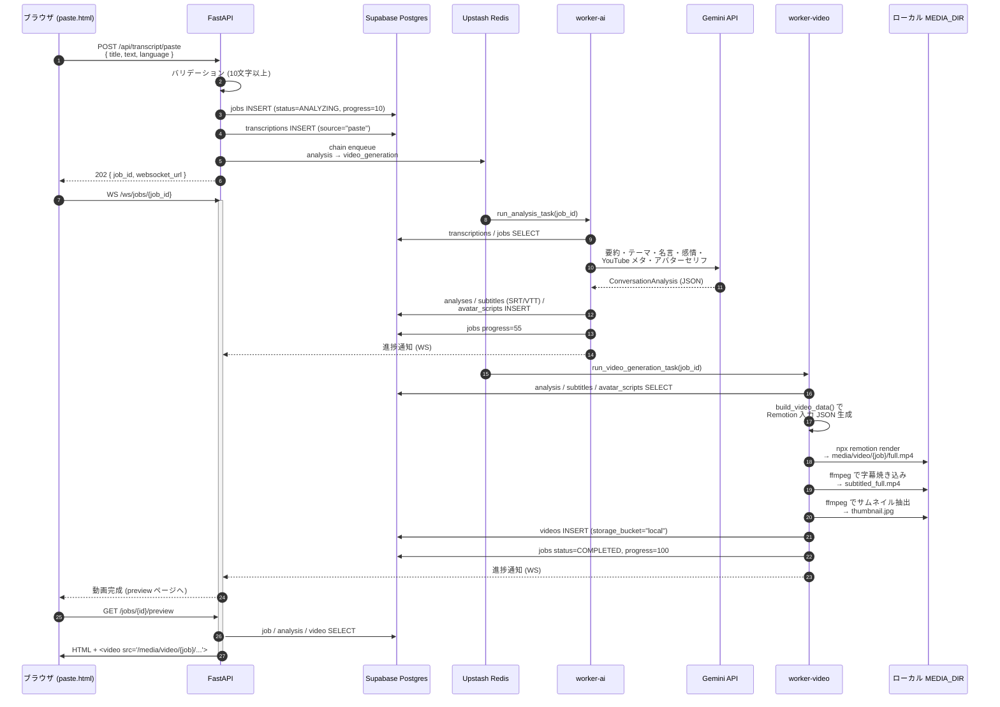
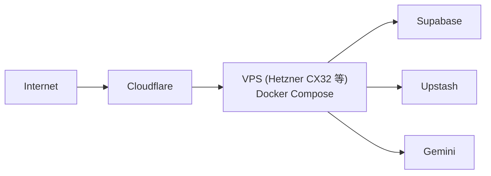

# システム構成図
## ConversationMovie

**文書バージョン**: 2.0.0
**作成日**: 2026-05-19
**最終更新**: 2026-05-21（Supabase / Upstash / ローカル実行構成へ刷新）

**更新メモ（2026-05-23）**: データ入力経路は音声ファイルに加え、トランスクリプトファイル（`.txt` / `.md` / `.srt` / `.vtt`）アップロードを含む。

---

## 0. 構成方針サマリ

MVP は **「Docker を使わず、ローカル Python venv + クラウドマネージドサービス」** で運用する。
重い AI 処理は将来 Docker / VPS に切り出すが、現時点では Windows 開発機 + クラウドで完結させる。

| 項目 | 旧設計 (v1.0) | 現行 (v2.0) |
|---|---|---|
| 実行環境 | Docker Compose 全部入り | ローカル Python venv（Windows） |
| データベース | Postgres コンテナ / Supabase | **Supabase PostgreSQL（直接接続）** |
| メッセージブローカ | Redis コンテナ | **Upstash Redis（rediss://）** |
| ストレージ | Supabase Storage | **ローカル `MEDIA_DIR`** + Supabase Storage（任意） |
| 入力 | 音声ファイルアップロード | **音声/トランスクリプトファイルアップロード + トランスクリプト貼り付け** |
| AI 処理 | Whisper + pyannote + Gemini | **Gemini のみ**（Whisper/話者分離は将来） |
| 動画生成 | Remotion (Docker 内 Node) | **Remotion（ローカル Node.js）** |
| YouTube 投稿 | 自動投稿 | **将来機能**（worker は雛形のみ） |

---

## 1. 全体システム構成図



**ポイント**

- **コンテナなし**: API も Celery ワーカーもローカル `.venv` 内で `uvicorn` / `celery` コマンドを別プロセスとして起動する。
- **DB 直接接続**: Supabase Postgres に対し、`DATABASE_URL=postgresql://...@db.xxxxx.supabase.co:5432/postgres` で psycopg2 から直接接続する（Alembic マイグレーションも同じ URL を使用）。
- **TLS 必須の Redis**: Upstash は `rediss://` (TLS) スキーマで接続する。Celery は同 URL をブローカ・結果バックエンドの両方で使用。
- **メディアはローカル**: 生成済み MP4 / サムネイルは `MEDIA_DIR` に保存し、`/media` 配下から StaticFiles で配信する（将来 Supabase Storage に切替可）。
- **Remotion はローカル Node**: `worker-video` がサブプロセスで `npx remotion render` を呼び出す。

---

## 2. プロセス構成（ローカル実行）

`docker compose up` ではなく、複数ターミナルで以下を起動する。



> **Windows 注意**: Celery のデフォルト prefork は Windows と相性が悪いため、`-P solo` または `-P threads` で起動する。

---

## 3. データフロー図

### 3.1 トランスクリプト貼り付け 〜 動画生成（現行 MVP）



### 3.2 将来追加予定のフロー（破線部分）

- **音声ファイル入力（強化予定）**: `POST /api/audio/upload` → `transcription_worker (Whisper)` → `diarization_worker (pyannote)` → `analysis_worker` 以降同じ
- **YouTube 投稿**: `POST /api/youtube/publish` → `worker-upload` → YouTube Data API v3

---

## 4. 環境変数構成（`.env` 抜粋）

```bash
# App
APP_ENV=development
APP_PORT=8000
APP_DEBUG=true

# DB: Supabase PostgreSQL（Settings → Database → Connection string → Direct）
DATABASE_URL=postgresql://postgres:<password>@db.<project-ref>.supabase.co:5432/postgres

# Supabase（Settings → API）
SUPABASE_URL=https://<project-ref>.supabase.co
SUPABASE_ANON_KEY=eyJ...
SUPABASE_SERVICE_ROLE_KEY=eyJ...

# Redis: Upstash（Console の "Redis URL" タブ。REST URL ではない）
REDIS_URL=rediss://default:<token>@<endpoint>.upstash.io:6379

# Gemini
GEMINI_API_KEY=AIza...

# YouTube（将来機能）
YOUTUBE_CLIENT_ID=
YOUTUBE_CLIENT_SECRET=
YOUTUBE_REDIRECT_URI=http://localhost:8000/api/youtube/callback

# ローカルパス（Windows 例）
MEDIA_DIR=C:/Users/<user>/Desktop/ConversationMovie/media
REMOTION_PROJECT_PATH=C:/Users/<user>/Desktop/ConversationMovie/remotion
NODE_PATH=node
WHISPER_MODEL_DIR=C:/Users/<user>/Desktop/ConversationMovie/models   # 将来用
WHISPER_MODEL=medium
WHISPER_DEVICE=cpu
MAX_UPLOAD_SIZE_MB=500
```

---

## 5. 起動手順（開発環境）

### 5.1 前提
- Python 3.11+
- Node.js 20+（Remotion 用）
- FFmpeg（PATH に通す）
- Supabase プロジェクト作成済み・スキーマ適用済み
- Upstash Redis データベース作成済み
- Gemini API キー取得済み

### 5.2 セットアップ

```powershell
# 1. リポジトリ取得
cd C:\Users\<user>\Desktop\ConversationMovie

# 2. .env を編集（Supabase / Upstash / Gemini の値を入れる）
copy .env.example .env

# 3. Python 仮想環境
cd backend
python -m venv .venv
.\.venv\Scripts\Activate.ps1
pip install -r requirements.txt

# 4. Alembic マイグレーション（Supabase Postgres へ）
alembic upgrade head

# 5. Remotion 依存
cd ..\remotion
npm install
cd ..\backend
```

### 5.3 起動（複数ターミナル）

```powershell
# ターミナル1: API
.\.venv\Scripts\Activate.ps1
uvicorn app.main:app --reload --port 8000

# ターミナル2: AI キュー（Gemini 分析）
.\.venv\Scripts\Activate.ps1
celery -A app.celery_app worker -Q ai --concurrency=1 -P solo --loglevel=info

# ターミナル3: video キュー（Remotion レンダリング）
.\.venv\Scripts\Activate.ps1
celery -A app.celery_app worker -Q video --concurrency=2 -P solo --loglevel=info

# ターミナル4 (任意): Flower 監視
.\.venv\Scripts\Activate.ps1
celery -A app.celery_app flower --port=5555
```

ブラウザで `http://localhost:8000/paste` を開きトランスクリプトを貼り付ける。

---

## 6. インフラ要件

### 6.1 開発環境

| リソース | 要件 | 備考 |
|---|---|---|
| OS | Windows 10/11 / macOS / Linux | MVP は Windows 動作確認済み |
| Python | 3.11+ | venv で管理 |
| Node.js | 20+ | Remotion 用 |
| FFmpeg | latest | 字幕焼き込み・サムネ抽出 |
| RAM | 8GB | Remotion レンダリング時にメモリ使用 |
| ストレージ | 10GB | 生成動画は `MEDIA_DIR` に蓄積 |

### 6.2 クラウドサービス（無料枠で MVP 運用可能）

| サービス | プラン | 用途 |
|---|---|---|
| Supabase | Free（500MB DB / 1GB Storage） | DB / 認証 / Storage |
| Upstash Redis | Free（10,000 commands/day） | Celery ブローカ |
| Gemini API | Free（15 RPM / 1M tokens/月） | AI 分析 |
| YouTube Data API | Free（10,000 quota/day） | 将来の自動投稿 |

### 6.3 将来の本番化方針

スケール時はバックエンドのみコンテナ化して VPS にデプロイする想定。



このとき復活する Docker Compose 構成は付録 A を参照。

---

## 7. 監視・ログ構成

### 7.1 MVP 段階

- **Flower** (`http://localhost:5555`): Celery タスクの実行状況
- **Supabase Dashboard**: DB クエリログ・データ確認
- **Upstash Console**: Redis のコマンド数・接続数
- **FastAPI `/health`**: DB / Redis の死活確認
- **loguru の標準出力**: 各プロセスのログ

```bash
# /health のレスポンス例
{
  "status": "ok",
  "version": "1.0.0",
  "services": { "database": "ok", "redis": "ok" }
}
```

### 7.2 将来の監視強化案

- Sentry（FastAPI / Celery のエラー追跡）
- Better Stack / Uptime Kuma（外形監視）
- Prometheus + Grafana（メトリクス）

---

## 付録 A. 旧 Docker Compose 構成（参考・本番化時に再利用）

開発初期に作成した `docker-compose.yml` は本番化用に残しているが、**MVP では使用しない**。
本番 VPS にデプロイする場合は以下の構成に切り戻す。

```yaml
services:
  api:          # FastAPI :8000
  worker-ai:    # celery -Q ai
  worker-video: # celery -Q video
  worker-upload:# celery -Q upload
  flower:       # :5555
  # db / redis はクラウド (Supabase / Upstash) を使い続ける
```

ローカル PC 上での Docker 起動は当面サポート対象外（パフォーマンス都合）。

---

*文書終端*
